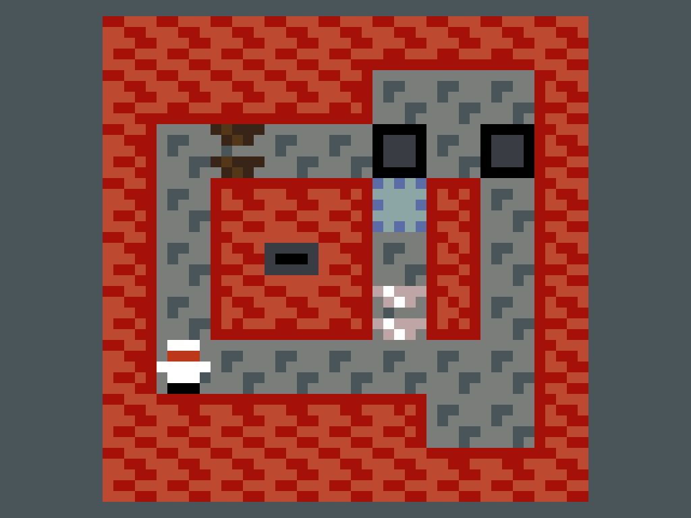
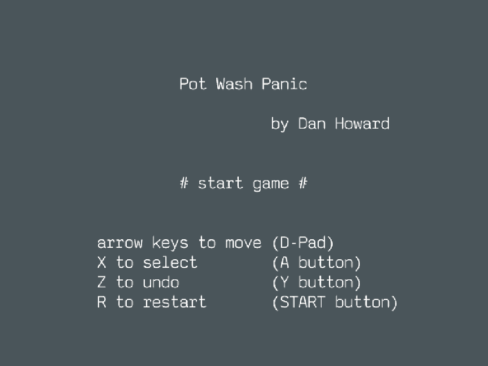

# PuzzleScript Retroarch Core

This is a libretro core that plays PuzzleScript games.

PuzzleScript games are usually online at the main PuzzleScript site:
https://www.puzzlescript.net/

To play games in the core, you will need to download the source for the game and save it as a `.pz` file.
The normal way to do this is to click the "hack" link on the game to go to the PuzzleScript editor, then
copy/paste the entire contents of the program into a file with extension `.pz`.

You can also find many games in the Accessible PuzzleScript repository. For these, save the `script.txt` file
into a file with extension `.pz`.
https://github.com/philschatz/puzzlescript/tree/master/games

The behavior of the core is designed to be as close as possible to the official website. Input bindings for
the core are done in terms of the RetroPad buttons. Depending on your actual input method this may be
somewhat confusing, especially if you have keyboard bindings to RetroPad buttons that differ from the standard
PuzzleScript keyboard bindings.

Input bindings are:

* Directional pad on RetroPad is movement (normally cursor keys on keyboard)
* `A` RetroPad button is ACTION (normally `X` on the keyboard)
* `Y` RetroPad button is UNDO (normally `Z` on the keyboard)
* `START` RetroPad button is RESTART (normally `R` on the keyboard)
* `L` RetroPad button is ESCAPE (normally `ESC` on the keyboard)
* `A+START` together is WIN level (this is cheating!!!)

My family had trouble reading the pixel font when playing games, so I replaced the default font with an anti-aliased
monospaced font. This can be controlled by the core option "Use custom anti-aliased font". After changing the option
you need to restart the current game to have it take effect. Default is on.

Many games have message text that refers to keys to press, so I added the RetroPad button names to the title
screen but still show the correspondence to keyboard keys. So if a game talks about pressing `R` to restart, hopefully
it makes sense what that means. I setup my own installation of RetroArch so that my keyboard bindings match the normal
PuzzleScript bindings (so `X` keyboard key maps to `A` RetroPad button etc.)

## Installing binary releases

Current binary releases are for Linux x86_64 and SEGA Genesis MINI console (Linux ARMv7).

### Linux x86_64

To install on Linux x86_64, copy the release file `x64/puzzlescript_libretro.so` to your RetroArch cores folder.
This is a configurable location, my core folder is at `~/.config/retroarch/cores`. Also copy `x64/puzzlescript_libretro.info` into your
Core Info directory. Mine is set to `~/.config/retroarch/cores/`.

### SEGA Genesis Mini

To run the core on the SEGA Genesis Mini console, you need to have RetroArch installed using something like Project Lunar or Hakchi.
The installation of RetroArch needs to be able to read a USB stick. Once that is true, copy the release file `arm/puzzlescript_libretro.so`
to your RetroArch cores folder on the USB stick. The tested configuration is Project Lunar, copying the file to `/project_lunar/retroarch/cores/`.
You also want to copy your `.pz` files to the USB stick. In this configuration, I start the PuzzleScript core first then load the game
content.

## Future work

* Support saving and loading game state.
* Add more cheat codes to navigate levels quickly.
* Support more platforms for binary releases.
* Add support for background music.
* Add volume level control and other audio options.
* Incorporate more accessibility features from: https://github.com/philschatz/puzzlescript

## Building from source

First install `gn` following instructions here:
https://gn.googlesource.com/gn/

Make sure NPM is installed:
https://docs.npmjs.com/downloading-and-installing-node-js-and-npm

Install dependencies:

    npm install

Build with:

    gn gen out
    ninja -C out

The output will be `out/puzzlescript_libretro.so` which can be copied to your RetroArch core folder.
Mine is set to `~/.config/retroarch/cores/`. You also want to copy `puzzlescript_libretro.info` into your
Core Info directory. Mine is set to `~/.config/retroarch/cores/`.

To quickly test output, do:

    ninja -C out && retroarch -L out/puzzlescript_libretro.so

### ARM

To compile for ARM based mini systems such as SEGA Genesis Mini, use the Linaro cross compile toolchain. Set args with:

    gn gen out/arm
    gn args out/arm

Add in a configuration line:

    target_cpu = "arm"

Download, uncompress, and untar the Linaro gcc toolchain and sysroot into `~/linaro`. Files are available here:

https://releases.linaro.org/components/toolchain/binaries/7.5-2019.12/arm-linux-gnueabihf/

You want these two:

https://releases.linaro.org/components/toolchain/binaries/7.5-2019.12/arm-linux-gnueabihf/gcc-linaro-7.5.0-2019.12-x86_64_arm-linux-gnueabihf.tar.xz

https://releases.linaro.org/components/toolchain/binaries/7.5-2019.12/arm-linux-gnueabihf/sysroot-glibc-linaro-2.25-2019.12-arm-linux-gnueabihf.tar.xz

After the args are set as above and the Linaro toolchain is extracted to `~/linaro`, build with:

    ninja -C out/arm

The output will again be `puzzlescript_libretro.so` in the `out/arm` directory. For the SEGA Genesis Mini, I use
Project Lunar and load cores from a USB stick. I copy the file to `/project_lunar/retroarch/cores/` and then run
RetroArch to find the cores and PZ files.

## Design Notes

The basic idea is to take the actual PuzzleScript source files and interpret them using Duktape in the core. Things like
the `window`, `document`, and canvas functionality are stubbed out into native function calls to handle input and graphics.

The only change I made to the PuzzleScript source files was to `graphics.js` to allow fonts of different sizes and to add
antialiasing to the font colors.

Much of the "stubbing" code was taken from Puzzlescript-Wrapper, huge shout out there:
https://github.com/Narkhos/Puzzlescript-Wrapper

For sound, I used my own translation of SFXR to C++. Sound generation is done entirely from seed number on the C++ side.

### Babel

I had to convert the PuzzleScript JS sources to older version of JavaScript to make it compatible with Duktape, there were
some issues with backtick literals (template strings). I used Babel and the CLI for this.

### ARM Compatibility

Using the Ubuntu 22.04 default ARM GCC cross compiler has a glibc that is too new for the SEGA Genesis Mini. I got errors like:

    [ERROR] Failed to open libretro core: "/opt/project_lunar/opt/retroarch/config/retroarch/cores/puzzlescript_libretro.so"
    [ERROR] Error(s): /lib/libm.so.6: version `GLIBC_2.27' not found (required by /opt/project_lunar/opt/retroarch/config/retroarch/cores/puzzlescript_libretro.so)

I switched to using Linaro 7.5, that works fine. I believe it has GLIBC 2.25.
https://releases.linaro.org/components/toolchain/binaries/7.5-2019.12/arm-linux-gnueabihf/

For any particular ARM embedded board there may be different version requirements.

### Performance

After setup, the `main.js` script sets up a main loop for the JavaScript side. A separate thread is spawned and calls this
infinite game loop. The main libretro thread handles audo and video callbacks, and adds input events to a queue. The JavaScript
thread handles game logic and rendering graphics to sprites and a separate backing framebuffer. In an ideal situation, the
main thread will be performant enough to never glitch and always handle the full FPS without graphical or audio underruns.
Each loop of the JavaScript main update thread hopefully happen within the game-defined `deltatime` interval. If the game
has too large maps or too many complicated rules, the update may be late. In this case there should be a time underrun
for game state update, but this should not affect the main thread doing audio and video callbacks.

In my limited testing on `x86_64` and the SEGA Genesis Mini ARMv7, performance was acceptable for almost all games
on `x86_64` and was highly game dependent for the SEGA Genesis Mini. Many realtime games were unplayable on the Mini,
but many complicated puzzle games were entirely playable. Performance was generally limited by game state updates
(not audio or video rendering).

### V8

I did some experiments with building with V8. Main issue is that V8 does a hermetic build, if you try to use local
tools and things you will usually encounter errors. So you have to use the recent clang in the distribution,
and the sysroot from Debian Bullseye on ARM. In the end that means your app also needs to use those things.
These are too new for the SEGA Genesis Mini system I have with Project Lunar.

I was able to get V8 working on x86_64, but this was not as interesting as getting something working on more
targets. If you're on x86 you probably already have a web browser and can go to the main PuzzleScript website
to play games.

V8 documentation is at:
https://v8.dev/docs/

## Generating releases

The `Dockerfile` is setup to build Linux x86_64 and ARMv7 binary builds on Ubuntu 18.04. Run using Docker newer than 18.09 with:

    DOCKER_BUILDKIT=1 docker build -o ../release .

There were a few hacks needed to get things working with the slightly older Python. In particular the font generation using Pillow
seemed to be broken. So I generated the custom font using my Ubuntu 22.04 desktop and checked in the output for use in the
BuildKit build.

## References

PuzzleScript project:
https://github.com/increpare/PuzzleScript

Accessible PuzzleScript
https://github.com/philschatz/puzzlescript

For making the retroarch core, I followed this tutorial:
https://web.archive.org/web/20190219134028/http://www.beardypig.com/2016/01/22/emulator-build-along-2/

A project using V8 to do standalone PuzzleScript games:
https://github.com/Narkhos/Puzzlescript-Wrapper

Docs for using V8:
https://v8.dev/docs/

Linaro toolchain:
https://releases.linaro.org/components/toolchain/binaries/
